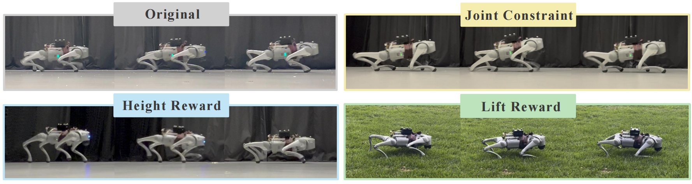

<div align="center">

# Flexible Locomotion Learning with Diffusion Model Predictive Control

[](https://arxiv.org/abs/2510.04234) [](https://ieee-icra.org/) [](https://opensource.org/licenses/MIT)

</div>



> [Flexible Locomotion Learning with Diffusion Model Predictive Control](https://arxiv.org/pdf/2510.04234) \
> Runhan Huang, Haldun Balim, Heng Yang, Yilun Du \
> ICRA 2026

## Installation

### 1. Create a Python Virtual Environment
- Create and activate a Python virtual environment (Python 3.8 recommended).

### 2. Install PyTorch
Run the following command to install PyTorch (CUDA 11.7 example):

```bash
pip3 install torch==1.13.0+cu117 torchvision==0.14.0+cu117 torchaudio==0.13.0+cu117 -f https://download.pytorch.org/whl/cu117/torch_stable.html
```

### 3. Install Isaac Gym
- Download and install **Isaac Gym Preview 4** from [NVIDIA Isaac Gym](https://developer.nvidia.com/isaac-gym).
- Install the required Python bindings:

```bash
cd isaacgym/python
pip install -e .
```

- Test the installation by running an example:

```bash
cd ../examples
python 1080_balls_of_solitude.py
```

### 4. Clone This Repository

```bash
git clone https://github.com/hrh6666/Flexible-Locomotion-Learning-with-Diffusion-Model-Predictive-Control.git flexible_dmpc
cd flexible_dmpc
```

### 5. Install `rsl_rl`

```bash
cd rsl_rl
pip install -e .
```

### 6. Install `legged_gym`

```bash
cd ../legged_gym
pip install -e .
cd ..
```

## Pipeline

### 1. Prepare Trajectory Dataset
Before pretraining, prepare a trajectory dataset in the format expected by the diffusion pipeline.

Expected dataset format (per trajectory):

- `obs`: shape `[T, 49]`
- `action`: shape `[T, 12]`
- `rew`: shape `[T]`

The collector saves a list of trajectory dicts into:

- `data/trajectory_<timestamp>/trajectory_<timestamp>.pt`
- `data/trajectory_<timestamp>/config.json`

#### PPO Demonstration Collection Example
Use the PPO policy rollout collector (`diffusion_collect.py`) to generate demonstration trajectories:

```bash
cd legged_gym
```

Ensure you are in the `flexible_dmpc/legged_gym` directory, and then run:

```bash
python legged_gym/scripts/diffusion_collect.py --task go2_remote --load_run <ppo_ckpt_path> --headless 
```

Dataset post-processing, eliminating base velocity in observation input:

```bash
python legged_gym/scripts/postprocess_dataset.py --src data/trajectory_<timestamp>
```

### 2. Offline Diffusion Pretraining
To pretrain the diffusion policy using collected trajectories:

```bash
cd legged_gym
python legged_gym/scripts/diffusion_pretrain.py --dataset <dataset_name>
```

The output is saved in:

- `logs/diffusion_pretrain/diffusion_pretrain_go2_<timestamp>/`
- `diffusion_pretrain_model_<iter>.pt`

We support pretraining our planner from more than one datasets.

### 3. Online Interactive Diffusion Training (Optional)
1. Update the `"load_run"` parameter in `legged_gym/legged_gym/envs/go2/go2_diffuser_config.py` with the log directory from Step 2.

   For example:

   ```python
   load_run = "diffusion_pretrain_go2_Aug12_04-48-46"
   ```

2. Ensure you are in the `flexible_dmpc/legged_gym` folder and run:

```bash
python legged_gym/scripts/train_diffuser.py --task go2_diffuser --headless
```

Config tuning entry (for training quality):

- Primary config: `legged_gym/legged_gym/envs/go2/go2_diffuser_config.py` (`Go2DiffuserCfgRunner`).
- Main training path is off-policy. For training behavior changes, read and align with:
  - `rsl_rl/rsl_rl/runners/diffuser_offpolicy_runner.py` (rollout/update schedule, replay pruning, diffusion/reward updates)
  - `rsl_rl/rsl_rl/storage/diffuser_rollout_storage.py` (trajectory filtering, segment sampling, weighting)
- Practical tuning workflow:
  - reward quality and guidance objective: edit `reward_model` and `guided_policy` blocks in config
  - optimization and data schedule: edit `runner` and `algorithm` blocks in config

Note: the main training path is off-policy (`DiffuserOffPolicyRunner`). Some on-policy fields are kept for legacy compatibility.

### 4. Test and Visualize Diffusion Planning
To test and visualize diffusion planning behavior:

```bash
cd legged_gym
python legged_gym/scripts/play_diffuser.py --task go2_diffuser --load_run <your_log_dir> --checkpoint <iter>
```

Test-time deployment controls (planning behavior):

- Reward planning:
  - Configure `guided_policy.reward_type` (`nn` or `analytic`).
  - For analytic reward, set `guided_policy.reward_name` and `guided_policy.reward_args`.
  - For NN reward from external checkpoint, set `guided_policy.reward_load_external=True` and `guided_policy.reward_external_path`.
- Candidate selection (only needed when evaluating multi-candidate planning):
  - Set `policy.num_candidate > 1`.
  - Configure candidate scorer with `guided_policy.candidate_same_as_reward` or `candidate_type` / `candidate_name` / `candidate_args` / `candidate_path`.
- Constraint projection:
  - Enable `guided_policy.apply_constraint=True`.
  - Define constraint modules via `guided_policy.constraint_name` and `guided_policy.constraint_args`.

These test-time fields are parsed in `legged_gym/scripts/play_diffuser.py` and passed into `GuidedPolicy` sampling.

Code pointers for deployment-side customization:

- `legged_gym/legged_gym/scripts/play_diffuser.py`
  - reward/candidate/constraint parsing from `guided_policy`
  - execution policy (replan margin, execute chunk, optional cache behavior)
- `rsl_rl/rsl_rl/algorithms/diffuser.py`
  - `GuidedPolicy` sampling and candidate selection logic

## Deployment on Real Robot
Deployment code will be released soon.

## Acknowledgement
- https://github.com/leggedrobotics/legged_gym
- https://github.com/zst1406217/robust_robot_walker
- https://github.com/jannerm/diffuser

## Citation

If you find this code useful for your research, please consider citing:

```bibtex
@article{huang2025flexible,
  title={Flexible Locomotion Learning with Diffusion Model Predictive Control},
  author={Huang, Runhan and Balim, Haldun and Yang, Heng and Du, Yilun},
  journal={arXiv preprint arXiv:2510.04234},
  year={2025}
}
```